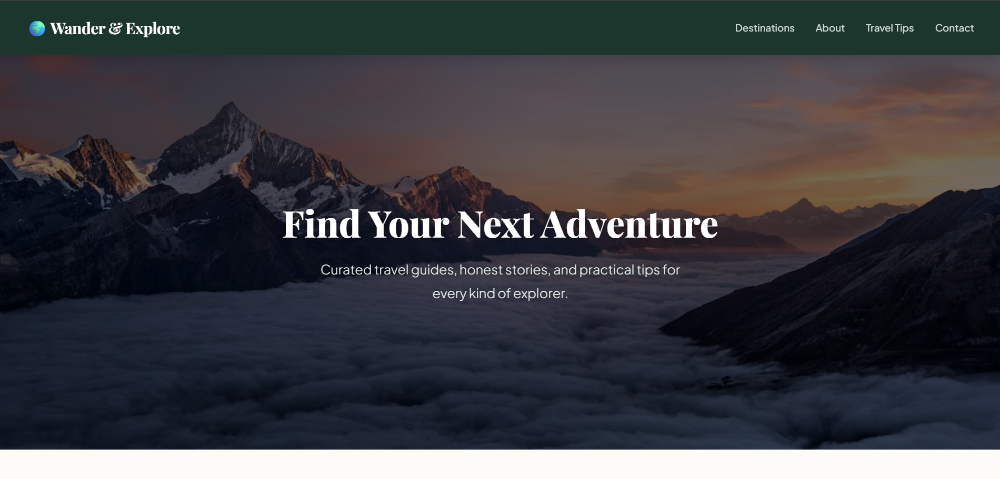

# 🌍 Wander & Explore – Travel Blog

> *Curated travel guides, honest stories, and practical tips for every kind of explorer.*


---

## 📌 Project Overview

**Wander & Explore** is a modern travel blog website developed using **HTML5** and **CSS3**. The website is designed to inspire travelers with beautiful destination showcases, practical travel tips, and curated travel stories — all wrapped in a clean, visually appealing layout.

---

## 🖥️ Project Preview



*Homepage featuring a stunning mountain hero section with "Find Your Next Adventure" heading*

---

## ✨ Features

- **Hero Section** – Full-screen background image with a bold call-to-action
- **Navigation Bar** – Links to Destinations, About, Travel Tips, and Contact
- **Latest Destinations** – Handpicked destination showcase cards
- **About Section** – Information about the blog and its purpose
- **Travel Tips** – Practical advice for all kinds of travelers
- **Responsive Design** – Clean and user-friendly layout

---

## 🛠️ Technologies Used

| Technology | Purpose |
|------------|---------|
| HTML5 | Page structure and content |
| CSS3 | Styling, layout, and visual design |

---

## 📁 Project Structure

```
DecodeLabs-Internship/
│
├── index.html        ← Main HTML file
├── README.md         ← Project documentation (this file)
└── preview.png       ← Screenshot of the project
```

---

## ▶️ How to Run

1. Download or clone this repository
2. Open the `index.html` file in any modern web browser (Chrome, Firefox, Edge, etc.)
3. No installation or server required — it runs directly in the browser!

```bash
# Clone the repository
git clone https://github.com/shayannaqvi45/DecodeLabs-Internship.git

# Open the file
cd DecodeLabs-Internship
open index.html
```

---

## 👨‍💻 Author

**Syed Muhammad Shayan Naqvi**

- 🏢 Internship: **DecodeLabs**
- 💻 Track: **Web Development**
- 🔗 GitHub: [@shayannaqvi45](https://github.com/shayannaqvi45)

---

## 📄 License

This project was developed as part of the **DecodeLabs Internship Program**.  
All rights reserved © 2025 Syed Muhammad Shayan Naqvi.

---

*Made with ❤️ during DecodeLabs Internship*
